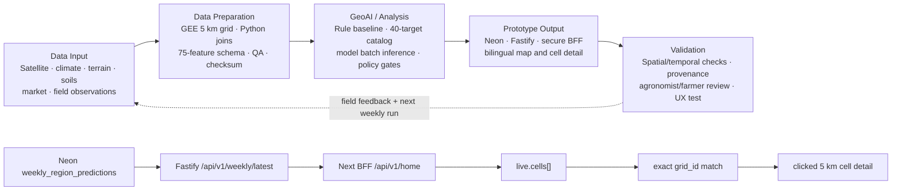

# Project Flow Chart

PowerPoint-ready exports:

- PNG: `artifacts/project-flowchart-16x9.png`
- Editable vector: `artifacts/project-flowchart-16x9.svg`

## Logical flow

## Presentation narration

1. **Data Input** — official satellite, rainfall, temperature, terrain, water, soil, market and field evidence are collected with provenance.
2. **Data Preparation** — Google Earth Engine and Python standardize the data on a 5 km grid, assemble the exact 75-feature contract, and fail on QA/schema drift.
3. **GeoAI / Analysis** — historical rules and audited model artifacts generate cell-level evidence under explicit validation and model-policy gates.
4. **Prototype Output** — Neon stores regional weekly payloads; Fastify and a secure server-side BFF deliver bilingual map, chart and detail views.
5. **Validation** — technical checks, spatial/temporal holdouts, freshness, agronomist/farmer review and UX testing feed improvements into the next weekly run.

